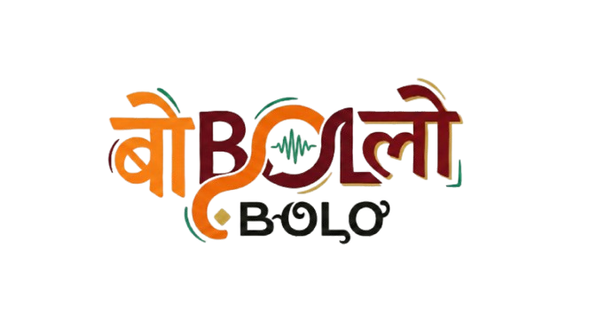
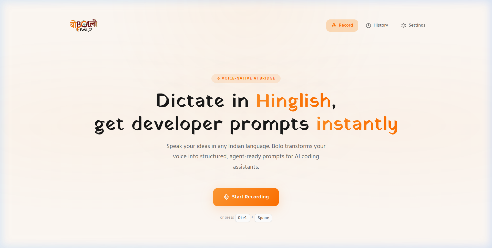

<p align="center">
  
</p>

<h1 align="center">Bolo — बोलो</h1>

<p align="center">
  <strong>Dictate in Hinglish. Get developer-grade prompts instantly.</strong><br/>
  <em>Voice-native agentic bridge for Indian developers.</em>
</p>

<p align="center">
  
  
  
</p>

---

## 🎯 What is Bolo?

**Bolo** (Hindi for *"speak"*) removes the translation tax for Indian developers. Instead of struggling to type prompts in English, just speak your ideas in **Hinglish, Hindi, Tamil, Bengali, Telugu** — or any Indian language — and Bolo transforms your voice into structured, agent-ready prompts that paste directly into AI coding assistants.

<p align="center">
  
</p>

### ✨ Key Features

| Feature | Description |
|---------|-------------|
| 🎙️ **Voice Recording** | One-click or `Ctrl + Space` hotkey to start dictating |
| 🗣️ **Indic STT** | Powered by Sarvam AI — supports Hinglish and 10+ Indian languages |
| 🧠 **Multiple LLMs** | Choose between Gemini 2.5 Flash & Sarvam INDUS for prompt structuring |
| 📋 **Auto-Copy** | Prompts automatically copied to clipboard, ready to paste |
| 📜 **Prompt History** | Last 50 prompts stored locally with search & favorites |
| 🔐 **Authentication** | User accounts & Admin Dashboard powered by Supabase Auth |
| 💳 **Credits & Payments**| Razorpay integration for daily quotas and top-ups |
| ⚙️ **Settings** | Configure STT provider, language, API keys, and preferences |
| 🖥️ **Desktop App** | Native Windows desktop experience built with Tauri v2 |

---

## 🚀 Quick Start

### Prerequisites

- **Node.js** 18+
- **Sarvam AI API Key** — for Indian language speech-to-text / LLM
- **Google Gemini API Key** — for prompt structuring
- **Supabase Project** — for database, authentication, and edge functions
- **Razorpay Keys** — for payment processing

### Installation

```bash
# Clone the repository
git clone https://github.com/NeuroKaran/Bolo-indie-AI.git
cd Bolo-indie-AI

# Install dependencies
npm install

# Create environment file
cp .env.example .env
# Add your API keys and Supabase URL/Anon Key to .env
```

### Running Locally

```bash
# Start frontend
npm run dev

# Start desktop app (Tauri)
npm run desktop
```

Open [http://localhost:5173](http://localhost:5173) in your browser.

### Building for Production

```bash
# Build web app
npm run build
npm run preview

# Build Windows desktop executable (.exe)
npm run build:desktop
```

---

## 🏗️ Architecture

```
Bolo/
├── public/
│   ├── Bolo-logo.png          # Brand logo
│   └── favicon.png            # Favicon
├── src/
│   ├── components/
│   │   ├── FloatingBar.jsx    # Recording overlay with waveform
│   │   ├── HistoryPanel.jsx   # Prompt history with search
│   │   ├── PromptCard.jsx     # Structured prompt display
│   │   ├── SettingsPanel.jsx  # Configuration UI
│   │   ├── Toast.jsx          # Notification system
│   │   └── Waveform.jsx       # Audio visualization
│   ├── services/
│   │   ├── sttService.js      # Sarvam AI STT integration
│   │   ├── promptService.js   # Gemini prompt structuring
│   │   ├── indusService.js    # Sarvam INDUS LLM integration
│   │   ├── clipboardService.js # Clipboard operations
│   │   ├── storageService.js  # LocalStorage persistence
│   │   ├── authService.js     # Supabase Auth logic
│   │   ├── paymentService.js  # Razorpay integration
│   │   └── supabaseClient.js  # Supabase client setup
│   ├── App.jsx                # Main application
│   ├── main.jsx               # Entry point
│   └── index.css              # Design system
├── index.html
└── package.json
```

### Data Flow

```
🎙️ Voice Input
    ↓
🔊 Audio Capture (Web Audio API)
    ↓
🗣️ Sarvam AI STT (Indic-aware transcription)
    ↓
🧠 Gemini 2.5 Flash (Prompt structuring)
    ↓
📋 Structured Prompt → Clipboard
```

---

## 🎨 Design

Bolo follows an **Indian-first aesthetic** with a design system rooted in Indian heritage:

- **Color Palette** — Saffron (`#FF9933`) & warm whites, inspired by the Indian flag
- **Typography** — [Yatra One](https://fonts.google.com/specimen/Yatra+One) (Mumbai railway signage), [Rozha One](https://fonts.google.com/specimen/Rozha+One) (Indian newspaper mastheads), [Hind](https://fonts.google.com/specimen/Hind) (Devanagari-first UI font)
- **Cultural Elements** — Devanagari `॥` danda dividers, ornamental shimmer animations
- **Texture** — Subtle paper-like background gradients

---

## 🛠️ Tech Stack

| Layer | Technology |
|-------|-----------|
| **Frontend** | React 19, Vite 7 |
| **Styling** | Vanilla CSS (custom design system) |
| **Icons** | Lucide React |
| **Database / Auth** | Supabase |
| **Edge Functions** | Deno (Supabase) |
| **Payments** | Razorpay |
| **Desktop App** | Tauri v2 (Rust) |
| **STT** | Sarvam AI |
| **LLM** | Google Gemini 2.5 Flash, Sarvam INDUS |

---

## ⌨️ Keyboard Shortcuts

| Shortcut | Action |
|----------|--------|
| `Ctrl + Space` | Open recording bar |
| `Escape` | Close recording bar |

---

## 🗺️ Roadmap

- [x] Voice capture & recording
- [x] Sarvam AI STT integration
- [x] Gemini prompt structuring
- [x] Clipboard auto-copy
- [x] Prompt history & favorites
- [x] Indian heritage typography
- [ ] VSCode / Cursor extension
- [ ] Mobile companion app
- [ ] Custom vocabulary dictionary
- [ ] Multi-provider STT switching

---

## 🤝 Contributing

Contributions are welcome! Feel free to open issues and pull requests.

```bash
# Run the linter
npm run lint

# Build the project
npm run build
```

---

## 📄 License

This project is licensed under the MIT License.

---

<p align="center">
  <br/>
  <strong>Built with ❤️ in India</strong><br/>
  <em>बोलो, और code करो!</em>
</p>
